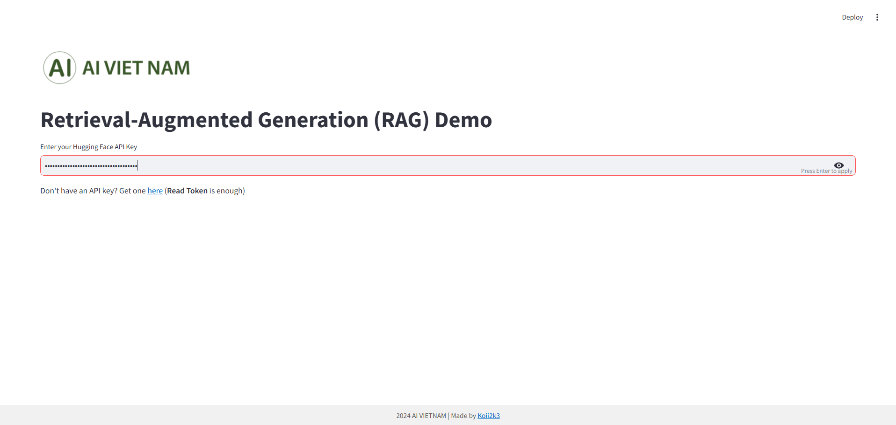
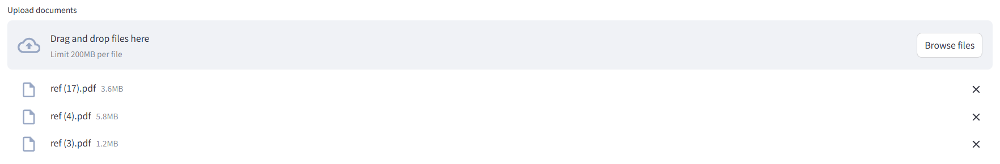
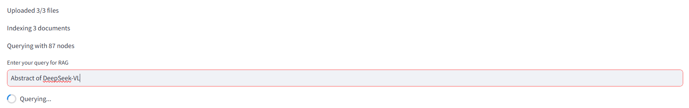
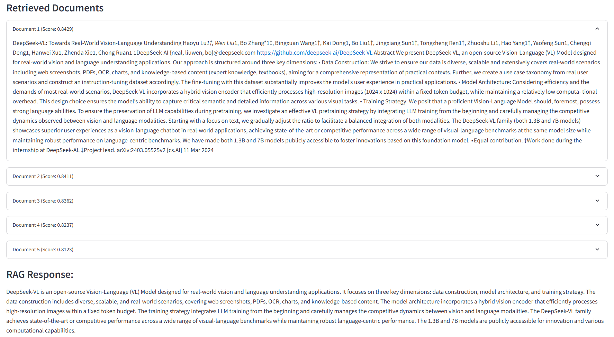

# AIVN - RAG with Llama Index Demo

This application demonstrates a Retrieval-Augmented Generation (RAG) model using Hugging Face APIs. Users can input their Hugging Face API key, upload PDF documents, and query the indexed documents to receive a synthesized answer based on the contents of the uploaded files.

## Features

- Enter your Hugging Face API key for model access.
- Upload multiple PDF documents for indexing.
- Query the indexed documents to get synthesized responses and their sources.

## Installation

1. Clone this repository to your local machine:
   ```bash
   git clone https://github.com/Koii2k3/Basic-RAG-LlamaIndex.git
   cd RAG_Streamlit
   ```

2. Install the required packages:
   ```bash
   pip install -r requirements.txt
   ```

3. Ensure you have your Hugging Face API key ready. You can create one [here](https://huggingface.co/settings/tokens) (Read Token is sufficient).

## Usage

1. **Input Hugging Face API Key**  
   Start the app and enter your Hugging Face API key.  
   

2. **Upload PDF Files**  
   Upload the documents you want to analyze.  
   

3. **Wait for Indexing and Enter Query**  
   After uploading, wait for the documents to be indexed and then input your query.  
   

4. **View Results**  
   The output will show the retrieved documents with their scores and a generated response based on your query.  
   

## Running the Application

To run the application, use the following command:
```bash
streamlit run app.py
```

## License

This project is licensed under the MIT License. See the LICENSE file for details.

## Contributing

Feel free to fork the repository and submit pull requests for improvements or features.

## Contact

Developed by [Koii2k3](https://github.com/Koii2k3/Basic-RAG-LlamaIndex). For any questions or issues, please open an issue in the repository.